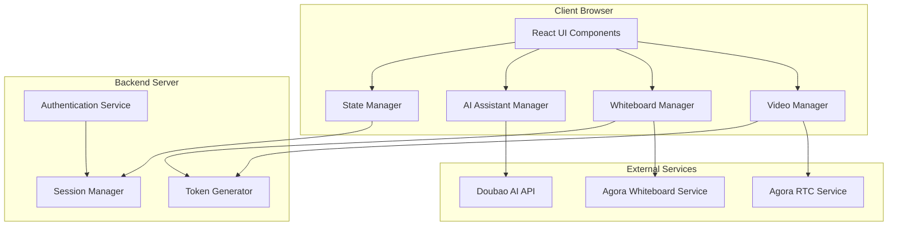

# Virtual Classroom Video Feature - Design Document

## Overview

The virtual classroom video feature is a web-based application that provides a comprehensive online learning environment for language tutoring. The system integrates real-time video communication, interactive whiteboard capabilities, presentation sharing, and an AI-powered assistant into a single cohesive interface.

### Technology Stack

- **Frontend Framework**: React with TypeScript for type safety and component reusability
- **Video Communication**: WebRTC with Agora SDK for reliable peer-to-peer video/audio
- **Whiteboard**: Agora Interactive Whiteboard SDK (Shengwang platform)
- **AI Integration**: Doubao API for multimodal AI assistance
- **State Management**: React Context API with hooks for global state
- **Styling**: CSS Modules with Flexbox/Grid for responsive layout, Tailwind CSS for utility-first styling
- **Build Tool**: Vite for fast development and optimized production builds
- **UI Design**: Modern minimalistic design with clean lines and ample whitespace

### Design System

**Brand Colors:**
- **Primary**: `#5C0099` (Deep Purple) - Main brand color for primary actions and headers
- **Secondary**: `#C86BFA` (Light Purple) - Hover states, secondary elements
- **Accent**: `#FDC500` (Golden Yellow) - Call-to-action buttons, active states
- **Accent Light**: `#FFD500` (Bright Yellow) - Highlights, notifications
- **Highlight**: `#FFEE32` (Light Yellow) - Subtle highlights, success states
- **Background**: `#03071E` (Dark Navy) - Primary background, text on light surfaces
- **Surface**: `#FFFFFF` (White) - Cards, panels, elevated surfaces
- **Surface Dark**: `#1A1A2E` (Dark Gray) - Secondary backgrounds

**Typography:**
- **Font Family**: Inter or SF Pro Display for modern, clean readability
- **Headings**: 600-700 weight, tight letter spacing
- **Body**: 400-500 weight, comfortable line height (1.6)
- **UI Elements**: 500 weight, slightly condensed

**Spacing System:**
- Base unit: 8px
- Scale: 4px, 8px, 16px, 24px, 32px, 48px, 64px

**Border Radius:**
- Small: 4px (buttons, inputs)
- Medium: 8px (cards, panels)
- Large: 12px (modals, major containers)
- Extra Large: 16px (video containers)

**Shadows:**
- Subtle: `0 1px 3px rgba(0, 0, 0, 0.1)`
- Medium: `0 4px 6px rgba(0, 0, 0, 0.1)`
- Large: `0 10px 25px rgba(0, 0, 0, 0.15)`

**Design Principles:**
- Minimalism: Remove unnecessary elements, focus on essential functionality
- Whitespace: Generous spacing between elements for breathing room
- Flat Design: Minimal use of shadows, clean borders
- Consistency: Uniform spacing, colors, and typography throughout
- Accessibility: High contrast ratios (WCAG AA compliant), clear focus states

## Architecture

### High-Level Architecture



### Component Layout

```
┌─────────────────────────────────────────────────────────────┐
│                  Classroom Container (#03071E bg)            │
│  ┌──────────────────┐  ┌──────────────────────────────────┐ │
│  │  Video Call      │  │                                  │ │
│  │  Module          │  │                                  │ │
│  │  (Top Left)      │  │     Presentation Panel           │ │
│  │  White surface   │  │     (White surface)              │ │
│  │  16px radius     │  │     12px radius                  │ │
│  │                  │  │                                  │ │
│  │  [Tutor Video]   │  │  - Textbook Display              │ │
│  │  [Tutee Video]   │  │  - Screen Share                  │ │
│  │  Purple accents  │  │  - Whiteboard Canvas             │ │
│  └──────────────────┘  │  - Annotation Layer              │ │
│  ┌──────────────────┐  │    (Yellow tools active)         │ │
│  │  AI Assistant    │  │                                  │ │
│  │  (Bottom Left)   │  │                                  │ │
│  │  White surface   │  │                                  │ │
│  │  12px radius     │  │                                  │ │
│  │  [Chat History]  │  │                                  │ │
│  │  [Input Field]   │  │                                  │ │
│  │  [Media Display] │  └──────────────────────────────────┘ │
│  │  Purple messages │                                        │
│  └──────────────────┘                                        │
│  ┌──────────────────────────────────────────────────────┐   │
│  │    Control Toolbar (Floating, translucent white)      │   │
│  │    Yellow accent for active tools                     │   │
│  └──────────────────────────────────────────────────────┘   │
└─────────────────────────────────────────────────────────────┘
```

**Modern UI Elements:**
- Clean white cards with subtle shadows floating on dark background
- Rounded corners (12-16px) for softer, modern feel
- Generous padding (24-32px) within cards
- Minimal borders, relying on shadows for depth
- Icon-first design for toolbar with tooltips
- Smooth transitions (200-300ms) for all interactive elements
- Glass-morphism effect on floating toolbar (backdrop blur)

## Components and Interfaces

### 1. Video Call Module

**Component Structure:**
- `VideoCallContainer`: Main container managing video streams
- `VideoPlayer`: Individual video stream renderer with rounded corners
- `AudioControls`: Mute/unmute controls with purple hover states
- `VideoControls`: Camera on/off controls with yellow active indicators

**Visual Design:**
- White card background (#FFFFFF) with medium shadow
- 16px border radius for modern feel
- Video streams stacked vertically with 16px gap
- Each video: 16px rounded corners, 2px border in #5C0099 when active
- Control icons: 40px circular buttons, #5C0099 background, white icons
- Hover state: #C86BFA background with smooth transition
- Active/muted state: #FDC500 background
- Connection indicator: Small dot (8px) - green for good, yellow for fair, red for poor
- Participant names: Small label overlay at bottom of video, semi-transparent dark background

**Key Interfaces:**

```typescript
interface VideoCallProps {
  sessionId: string;
  userId: string;
  userRole: 'tutor' | 'tutee';
  onConnectionChange: (status: ConnectionStatus) => void;
}

interface VideoStream {
  userId: string;
  streamId: string;
  videoTrack: ILocalVideoTrack | IRemoteVideoTrack;
  audioTrack: ILocalAudioTrack | IRemoteAudioTrack;
  isLocal: boolean;
}

interface ConnectionStatus {
  state: 'connecting' | 'connected' | 'disconnected' | 'reconnecting';
  quality: 'excellent' | 'good' | 'poor' | 'bad';
}
```

**Implementation Details:**
- Use Agora RTC SDK for WebRTC abstraction
- Implement automatic quality adjustment based on network conditions
- Support up to 2 participants (tutor and tutee)
- Video resolution: 640x480 (VGA) with adaptive bitrate
- Audio: 48kHz sample rate, stereo

### 2. Presentation Panel

**Component Structure:**
- `PresentationContainer`: Main presentation area
- `PDFViewer`: Renders PDF textbooks
- `ScreenShareDisplay`: Shows shared screen
- `WhiteboardCanvas`: Interactive drawing surface
- `AnnotationLayer`: Overlay for annotations
- `NavigationControls`: Page/slide navigation

**Visual Design:**
- Large white card (#FFFFFF) with subtle shadow
- 12px border radius
- Full-height right side (60% of screen width)
- Minimal top toolbar: Mode switcher (PDF/Screen/Whiteboard) with pill-style buttons
- Active mode: #FDC500 background, #03071E text
- Inactive mode: Transparent background, #03071E text, hover #C86BFA
- Content area: Clean white canvas with no borders
- Navigation: Floating circular buttons (48px) at bottom center
  - Previous/Next: #5C0099 background, white icons
  - Page counter: Small text between buttons
- Zoom controls: Floating in top-right corner, minimal icon buttons

**Key Interfaces:**

```typescript
interface PresentationProps {
  sessionId: string;
  mode: 'pdf' | 'screenshare' | 'whiteboard';
  onModeChange: (mode: PresentationMode) => void;
}

interface PresentationContent {
  type: 'pdf' | 'screenshare' | 'whiteboard';
  data: PDFDocument | MediaStream | WhiteboardRoom;
  currentPage?: number;
  totalPages?: number;
}

interface AnnotationTool {
  type: 'pen' | 'highlighter' | 'eraser' | 'shape' | 'text';
  color: string;
  size: number;
}
```

**Implementation Details:**
- Use PDF.js for PDF rendering
- Integrate Agora Interactive Whiteboard SDK
- Canvas-based annotation layer with pointer events
- Support multi-page navigation with thumbnail preview
- Real-time synchronization of annotations across participants

### 3. Whiteboard Integration

**Component Structure:**
- `WhiteboardManager`: Manages whiteboard SDK lifecycle
- `ToolPalette`: Drawing tool selection
- `ColorPicker`: Color selection for tools
- `WhiteboardControls`: Clear, undo, redo, save

**Visual Design:**
- Floating vertical toolbar on left side of presentation panel
- Semi-transparent white background with backdrop blur (glass-morphism)
- 12px border radius, subtle shadow
- Tool icons: 44px square buttons with 8px radius
- Active tool: #FDC500 background with white icon
- Inactive tools: Transparent background, #03071E icons
- Hover: #C86BFA background with smooth transition
- Color picker: Horizontal row of color dots (24px each)
  - Brand colors plus black, white, red, blue, green
  - Selected color: 3px border in #5C0099
- Stroke width selector: Visual slider with 3 preset sizes
- Action buttons (undo/redo/clear/save): Separated by divider line
  - Destructive actions (clear): Red accent on hover

**Key Interfaces:**

```typescript
interface WhiteboardConfig {
  appId: string;
  roomId: string;
  roomToken: string;
  userId: string;
  userRole: 'admin' | 'writer' | 'reader';
}

interface WhiteboardState {
  isConnected: boolean;
  currentTool: DrawingTool;
  currentColor: string;
  strokeWidth: number;
  canUndo: boolean;
  canRedo: boolean;
}

interface DrawingTool {
  type: 'pencil' | 'rectangle' | 'circle' | 'line' | 'text' | 'eraser';
  config: ToolConfig;
}
```

**Implementation Details:**
- Initialize Agora Whiteboard SDK with room credentials
- Tutor has 'admin' role, tutee has 'writer' role
- Implement tool state management with React hooks
- Support saving whiteboard snapshots to server
- Handle reconnection and state recovery

### 4. AI Assistant

**Component Structure:**
- `AIAssistantContainer`: Main AI chat interface
- `MessageList`: Displays conversation history
- `MessageInput`: Text input for queries
- `MediaRenderer`: Displays images/videos from AI
- `ActionButtons`: Quick actions (share to presentation, etc.)

**Visual Design:**
- White card (#FFFFFF) with medium shadow
- 12px border radius
- Header: "AI Assistant" with small AI icon, #5C0099 text
- Chat area: Scrollable message list with generous padding
- User messages:
  - Right-aligned bubbles
  - #5C0099 background, white text
  - 12px radius (squared on bottom-right)
  - Max width 80%
- AI messages:
  - Left-aligned bubbles
  - #F5F5F5 background, #03071E text
  - 12px radius (squared on bottom-left)
  - Max width 80%
- Media content: Full-width cards with 8px radius, subtle border
  - Thumbnail with play icon for videos
  - "Share to Presentation" button: #FDC500 background, small, rounded
- Input area:
  - Clean text input with subtle border
  - 8px radius, focus state: #5C0099 border (2px)
  - Send button: Circular (40px), #FDC500 background, white icon
  - Microphone icon for voice input (optional)
- Loading state: Animated dots in brand colors
- Empty state: Centered icon and text with suggestions

**Key Interfaces:**

```typescript
interface AIAssistantProps {
  sessionId: string;
  onMediaShare: (media: MediaContent) => void;
}

interface AIMessage {
  id: string;
  role: 'user' | 'assistant';
  content: string;
  media?: MediaContent[];
  timestamp: Date;
}

interface MediaContent {
  type: 'image' | 'video';
  url: string;
  thumbnail?: string;
  title?: string;
  description?: string;
}

interface DoubaoRequest {
  messages: AIMessage[];
  model: string;
  stream: boolean;
  multimodal: boolean;
}
```

**Implementation Details:**
- Use Doubao API with multimodal model support
- Implement streaming responses for better UX
- Cache conversation history in session storage
- Support image search and video retrieval
- Provide "Share to Presentation" button for media content
- Handle API rate limiting and errors gracefully

### 5. State Management

**Global State Structure:**

```typescript
interface ClassroomState {
  session: SessionInfo;
  video: VideoState;
  presentation: PresentationState;
  whiteboard: WhiteboardState;
  ai: AIState;
  ui: UIState;
}

interface SessionInfo {
  sessionId: string;
  userId: string;
  userRole: 'tutor' | 'tutee';
  participants: Participant[];
  startTime: Date;
  isActive: boolean;
}

interface VideoState {
  localStream: VideoStream | null;
  remoteStreams: Map<string, VideoStream>;
  connectionStatus: ConnectionStatus;
  isAudioMuted: boolean;
  isVideoOff: boolean;
}

interface PresentationState {
  mode: 'pdf' | 'screenshare' | 'whiteboard';
  content: PresentationContent | null;
  currentPage: number;
  annotations: Annotation[];
  activeTool: AnnotationTool | null;
}
```

**State Management Approach:**
- Use React Context for global state
- Implement custom hooks for each module (useVideo, useWhiteboard, useAI)
- Use reducers for complex state updates
- Persist critical state to session storage for recovery

## Data Models

### Session Model

```typescript
interface Session {
  id: string;
  tutorId: string;
  tuteeId: string;
  scheduledTime: Date;
  duration: number; // minutes
  status: 'scheduled' | 'active' | 'completed' | 'cancelled';
  agoraChannelName: string;
  whiteboardRoomId: string;
  createdAt: Date;
  updatedAt: Date;
}
```

### Participant Model

```typescript
interface Participant {
  userId: string;
  name: string;
  role: 'tutor' | 'tutee';
  joinedAt: Date;
  connectionStatus: 'online' | 'offline';
  agoraUid: number;
}
```

### Annotation Model

```typescript
interface Annotation {
  id: string;
  userId: string;
  type: 'stroke' | 'shape' | 'text';
  data: StrokeData | ShapeData | TextData;
  pageNumber: number;
  timestamp: Date;
}

interface StrokeData {
  points: Point[];
  color: string;
  width: number;
}

interface ShapeData {
  type: 'rectangle' | 'circle' | 'line';
  start: Point;
  end: Point;
  color: string;
  strokeWidth: number;
}

interface TextData {
  content: string;
  position: Point;
  fontSize: number;
  color: string;
}
```

## Error Handling

### Video Call Errors

1. **Connection Failures**
   - Display user-friendly error message
   - Attempt automatic reconnection (max 3 attempts)
   - Provide manual reconnect button
   - Log errors to monitoring service

2. **Media Device Errors**
   - Check for camera/microphone permissions
   - Show permission request dialog
   - Fallback to audio-only mode if camera unavailable
   - Display device selection UI

3. **Network Quality Issues**
   - Monitor network quality metrics
   - Automatically reduce video quality
   - Show quality indicator to users
   - Suggest switching to audio-only if severe

### Whiteboard Errors

1. **SDK Initialization Failures**
   - Retry initialization with exponential backoff
   - Fall back to basic canvas if SDK unavailable
   - Display error notification to user

2. **Synchronization Issues**
   - Implement conflict resolution for concurrent edits
   - Queue operations during disconnection
   - Replay queued operations on reconnection

### AI Assistant Errors

1. **API Failures**
   - Show error message in chat
   - Implement retry logic with backoff
   - Cache recent responses for offline access
   - Provide fallback to basic search

2. **Rate Limiting**
   - Display rate limit warning
   - Queue requests when limit reached
   - Show estimated wait time

## Testing Strategy

### Unit Testing

- Test individual React components in isolation
- Mock external SDK dependencies (Agora, Doubao)
- Test state management logic with reducers
- Validate data model transformations
- Test utility functions and helpers

**Tools**: Jest, React Testing Library

### Integration Testing

- Test component interactions within modules
- Verify state updates across components
- Test API integration with mocked responses
- Validate WebRTC connection flow
- Test whiteboard synchronization logic

**Tools**: Jest, React Testing Library, MSW (Mock Service Worker)

### End-to-End Testing

- Test complete user flows (join session, share content, use AI)
- Verify multi-user scenarios (tutor and tutee interactions)
- Test error recovery scenarios
- Validate responsive layout on different screen sizes
- Test browser compatibility (Chrome, Firefox, Safari, Edge)

**Tools**: Playwright or Cypress

### Performance Testing

- Measure video call latency and quality
- Test with varying network conditions
- Monitor memory usage during long sessions
- Validate whiteboard rendering performance
- Test AI response times

**Tools**: Chrome DevTools, Lighthouse, WebPageTest

### Manual Testing Checklist

- [ ] Video and audio quality in various network conditions
- [ ] Whiteboard tool responsiveness and accuracy
- [ ] AI assistant response quality and relevance
- [ ] Layout responsiveness on different screen sizes
- [ ] Cross-browser compatibility
- [ ] Accessibility with keyboard navigation
- [ ] Error handling and recovery flows

## Security Considerations

### Authentication and Authorization

- Implement JWT-based authentication
- Validate session access before joining
- Generate time-limited tokens for Agora services
- Secure API keys on backend (never expose in frontend)

### Data Protection

- Encrypt video/audio streams (DTLS-SRTP)
- Use HTTPS for all API communications
- Sanitize user inputs to prevent XSS
- Implement CORS policies
- Store sensitive data encrypted at rest

### Privacy

- No recording without explicit consent
- Clear session data after completion
- Comply with data retention policies
- Provide privacy policy and terms of service

## UI/UX Enhancements

### Animations and Transitions

- Page transitions: 300ms ease-in-out
- Button hover: 200ms ease
- Modal/dialog: Fade in with scale (250ms)
- Toast notifications: Slide in from top-right
- Loading states: Skeleton screens with shimmer effect in brand colors
- Tool selection: Smooth color transition with slight scale (1.05x)

### Responsive Behavior

- Minimum viewport: 1280x720px
- Tablet (768-1279px): Stack video and AI vertically on left
- Mobile: Not supported, show message to use desktop
- Flexible grid system with CSS Grid
- Maintain aspect ratios for video (16:9)

### Accessibility

- Keyboard navigation: Tab order follows visual flow
- Focus indicators: 3px #FDC500 outline with 2px offset
- ARIA labels for all interactive elements
- Screen reader announcements for state changes
- High contrast mode support
- Reduced motion support (prefers-reduced-motion)

### Micro-interactions

- Button press: Slight scale down (0.95x)
- Success actions: Brief #FFEE32 glow
- Error states: Shake animation with red accent
- Connection status: Pulse animation on indicator dot
- New message: Subtle bounce on AI assistant icon
- Tool selection: Haptic feedback (if supported)

## Performance Optimization

### Video Optimization

- Implement adaptive bitrate streaming
- Use VP8/VP9 codec for better compression
- Limit resolution based on viewport size
- Implement simulcast for better quality adaptation

### Rendering Optimization

- Use React.memo for expensive components
- Implement virtual scrolling for AI chat history
- Debounce annotation drawing events (16ms for 60fps)
- Use requestAnimationFrame for smooth animations
- Lazy load PDF pages
- CSS containment for isolated components
- Use CSS transforms for animations (GPU acceleration)

### Network Optimization

- Compress API payloads
- Implement request caching where appropriate
- Use WebSocket for real-time updates
- Batch annotation updates
- Implement progressive image loading
- Preload critical assets
- Code splitting by route

## Deployment Considerations

### Frontend Deployment

- Build optimized production bundle with Vite
- Deploy to CDN for global distribution
- Implement service worker for offline capabilities
- Use environment variables for API endpoints

### Backend Requirements

- Node.js server for token generation
- Session management database (PostgreSQL/MongoDB)
- Redis for session caching
- Load balancer for horizontal scaling

### Monitoring

- Implement error tracking (Sentry)
- Monitor video quality metrics
- Track API usage and rate limits
- Set up alerts for critical failures
- Log user actions for debugging
